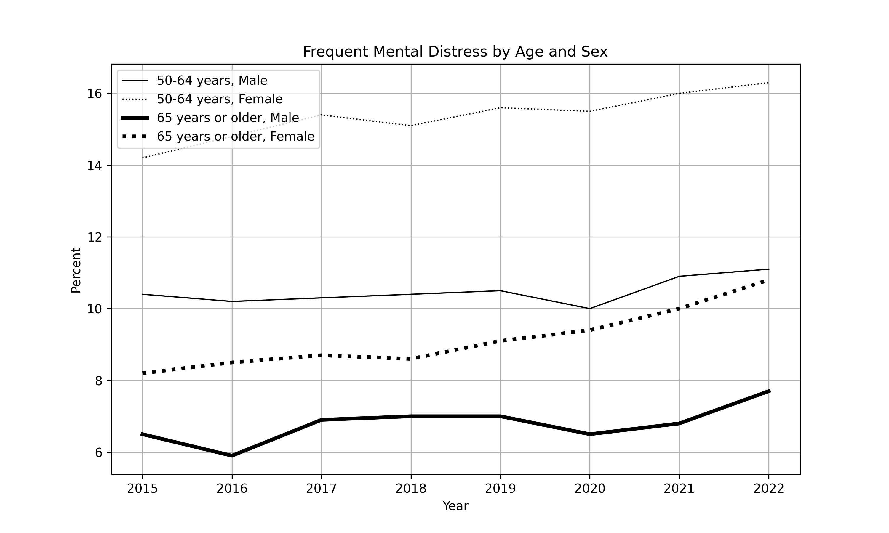

# alzheimer

Download the CDC dataset and rename it to data.csv. 

Create your query to generative AI to be able to display the following figure on trends of Alzheimer's frequent mental distress by age and by sex.

